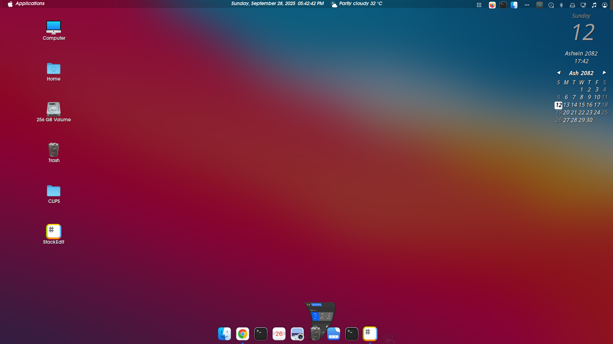

# 🛠️ My Linux Mint Cinnamon Setup — macOS Big Sur Inspired Look

## 🖼️ Screenshot

Here’s how my desktop looks after all the customizations:




This is my personal reference guide for setting up a **macOS Big Sur–like desktop** on Linux distributions that use the **Cinnamon desktop environment**, such as:

- Linux Mint  
- Feren OS  
- OpenSUSE with Cinnamon  
- Debian Cinnamon Flavor  
- Fedora Cinnamon Spin  
- Arch with Cinnamon  
- Manjaro Cinnamon Edition  

I wrote this for **myself** so that I don’t have to go through all the hassle again when setting it up next time.  
Everything below is exactly how **I like my Cinnamon desktop customized**.

---

## 📦 What I Usually Do

- Final Result Preview  
- Initial Setup  
- Install GTK Theme - WhiteSur Light/Dark  
- Install Icons Theme - WhiteSur Light/Dark  
- Install Cursors Theme - McMojave  
- Configure Panel and Applets  
- Install and Configure Plank Dock  
- Install and Configure Albert Launcher  
- Install and Configure Conky Manager  
- Do Some Additional Settings  
- Install Nautilus and Set it as Default File Manager  
- Make Terminal Transparent  
- Setup Firefox Theme  
- Arrange Desktop Icons  

---

## ⚙️ Initial Setup & Tweaks

The first few changes I always make before installing anything:

1. In **System Settings → Windows**, I change the **button layout** from **right to left**.
2. I update the **Alt + Tab behavior** to use **Coverflow 3D** for a more fluid window switcher.
3. In **Hot Corner settings**, I set the **top-left corner** to **Show Workspaces**.

---

## 🧩 Extensions and Panel Customization

I install and configure a few extensions and panel tweaks right away:

- Installed **Transparent Panel** extension.
- Enabled it and set the **transparency type** to `Semi-transparent`.
- Disabled theme transparency within the extension’s settings.

Then, I change my **background wallpaper** to a macOS Big Sur–style wallpaper.  

📦 [macOS Big Sur Wallpaper Pack](https://www.pling.com/p/1400125)

---

## 🎨 GTK Theme — WhiteSur Light/Dark

I install the **WhiteSur GTK theme** to get the macOS Big Sur look:

```bash
git clone https://github.com/vinceliuice/WhiteSur-gtk-theme.git
cd WhiteSur-gtk-theme
./install.sh
