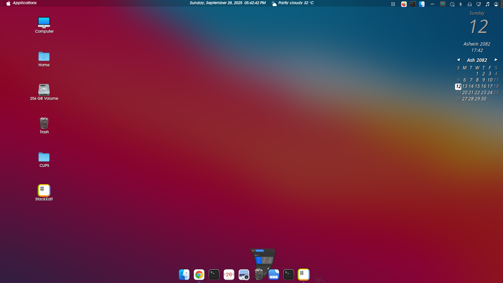

----------

```markdown
# 🛠️ My Linux Mint Cinnamon Setup — macOS Big Sur Inspired Look

## 🖼️ Screenshot

Here’s how my desktop looks after all the customizations:




This is my personal reference guide for setting up a **macOS Big Sur–like desktop** on Linux distributions that use the **Cinnamon desktop environment**, such as:

- Linux Mint  
- Feren OS  
- OpenSUSE with Cinnamon  
- Debian Cinnamon Flavor  
- Fedora Cinnamon Spin  
- Arch with Cinnamon  
- Manjaro Cinnamon Edition  

I wrote this for **myself** so that I don’t have to go through all the hassle again when setting it up next time.  
Everything below is exactly how **I like my Cinnamon desktop customized**.

---

## 📦 What I Usually Do

- Final Result Preview  
- Initial Setup  
- Install GTK Theme - WhiteSur Light/Dark  
- Install Icons Theme - WhiteSur Light/Dark  
- Install Cursors Theme - McMojave  
- Configure Panel and Applets  
- Install and Configure Plank Dock  
- Install and Configure Albert Launcher  
- Install and Configure Conky Manager  
- Do Some Additional Settings  
- Install Nautilus and Set it as Default File Manager  
- Make Terminal Transparent  
- Setup Firefox Theme  
- Arrange Desktop Icons  

---

## ⚙️ Initial Setup & Tweaks

The first few changes I always make before installing anything:

1. In **System Settings → Windows**, I change the **button layout** from **right to left**.
2. I update the **Alt + Tab behavior** to use **Coverflow 3D** for a more fluid window switcher.
3. In **Hot Corner settings**, I set the **top-left corner** to **Show Workspaces**.

---

## 🧩 Extensions and Panel Customization

I install and configure a few extensions and panel tweaks right away:

- Installed **Transparent Panel** extension.
- Enabled it and set the **transparency type** to `Semi-transparent`.
- Disabled theme transparency within the extension’s settings.

Then, I change my **background wallpaper** to a macOS Big Sur–style wallpaper.  

📦 [macOS Big Sur Wallpaper Pack](https://www.pling.com/p/1400125)

---

## 🎨 GTK Theme — WhiteSur Light/Dark

I install the **WhiteSur GTK theme** to get the macOS Big Sur look:

```bash
git clone https://github.com/vinceliuice/WhiteSur-gtk-theme.git
cd WhiteSur-gtk-theme
./install.sh

```

📁 [WhiteSur GTK Theme Repository](https://github.com/vinceliuice/WhiteSur-gtk-theme)

----------

## 🪄 Cursor Theme — McMojave

I install the **McMojave cursor theme** for a polished macOS cursor feel:

```bash
git clone https://github.com/vinceliuice/McMojave-cursors.git
cd McMojave-cursors
sudo cp -r McMojave* /usr/share/icons/

```

📁 [McMojave Cursors Repository](https://github.com/vinceliuice/McMojave-cursors)

----------

## 🧰 Configuring Panel and Applets

Here’s how I usually set up my panel and applets:

1.  I **move the panel to the top**.
    
2.  I **remove all pinned applications** from it.
    
3.  I install the **CinnaMenu applet**, apply a custom logo, and rename it to **Applications**.
    
4.  I install a **Weather applet** and configure it manually:
    
    -   Entered latitude, longitude, city, country, and timezone (`Asia/Kathmandu`).
        
    -   Used **Open-Metro Data** as the weather provider (does not require API keys).
        
5.  I install:
    
    -   **Expo Applet** – Workspace manager.
        
    -   **Nepali Patro Calendar Desklet** – `nepalipatro@deeppradhan`
        
    -   **Scale Applet** – Shows all open windows like an application switcher ([Scale Applet](https://cinnamon-spices.linuxmint.com/desklets/view/43))
        
    -   **User Applet** – (no extra configuration needed)
        
    -   **Calendar Applet** with a custom date format:
        
        ```
        %A, %B %e, %Y  %I:%M:%S %p
        
        ```
        
6.  I position **Weather** and **Calendar** in the **center top** of the panel.
    

----------

## 📌 Plank Dock Setup

I install and configure **Plank Dock** for a macOS-style dock:

```bash
sudo apt install plank

```

📁 [WhiteSur Plank Theme Pack](https://github.com/vinceliuice/WhiteSur-gtk-theme/tree/master/src/other/plank)

> 💡 Note: This is included in the WhiteSur GTK theme — no need to download separately, just for reference.

-   I copy the Plank theme from:
    
    ```
    WhiteSur-Gtk/src/other/plank
    
    ```
    
    to:
    
    ```
    ~/.local/share/plank/theme
    
    ```
    
-   Then, I select that theme from Plank settings.
    
-   I also add Plank to the **Startup Applications** list so it launches automatically.
    

----------

## 🔍 Albert Launcher Setup

I install and configure **Albert Launcher** as a spotlight-style app launcher.

📥 [Download Albert](https://software.opensuse.org/download.html?project=home%3Amanuelschneid3r&package=albert)  
🎨 [Albert Theme](https://store.kde.org/p/1410038/)

> 💡 Note: I didn’t find a single perfect package, so this might require some trial and error — some builds will work for sure.

-   After installation, I copy the theme file to:
    
    ```
    /usr/share/albert/
    
    ```
    
-   Then I select the theme from Albert’s preferences.
    
-   I also make sure Albert is in the **Startup Applications** list.
    

----------

## 📁 Nautilus as Default File Manager

I prefer Nautilus as my default file manager, so I install it with:

```bash
sudo apt install nautilus

```

Then I set it as the default file manager in system settings.

----------

## 🪟 Terminal Transparency

I make the terminal **semi-transparent** through its preferences settings.

----------

## 🦊 Firefox Theme — WhiteSur

I change the **Firefox browser theme** following the guide from the GitHub repository:

📁 [WhiteSur Firefox Theme Guide](https://github.com/vinceliuice/WhiteSur-gtk-theme/tree/master/src/other/firefox)

> 💡 This is also included inside the same WhiteSur GTK theme folder — just search for it or follow the guide above.

----------

## 🖥️ Final Desktop Layout

Finally, I **arrange the desktop icons** and align everything to achieve a clean, macOS-like layout.

----------

## 🏁 Final Thoughts

With all these steps, I transform my Cinnamon desktop into something that **closely resembles macOS Big Sur** — clean, elegant, and modern — while keeping the power and freedom of **Linux**.

----------

#macOSBigSur #Linux #OpenSource

```

---

✅ **Why this version is better:**

- Uses **proper `[text](link)`** formatting for easy HTML conversion.  
- Clear blockquotes (`> 💡`) for notes and tips — render beautifully in HTML and Markdown.  
- Code blocks and links are consistently styled.  
- Spacing is normalized for readability and export.  
- Fully ready to drop into a `.md` file *or* convert directly with tools like `pandoc` or `markdown-it` to HTML.

---

Would you like me to add a **Table of Contents** section at the top (auto-linking to sections) too? (It makes the HTML version much easier to navigate.)

```
